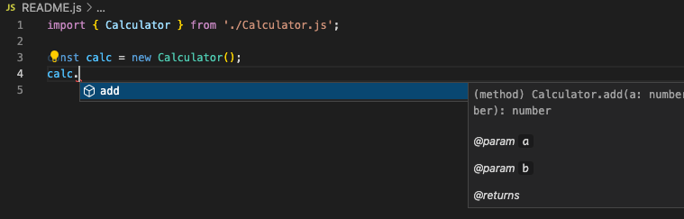
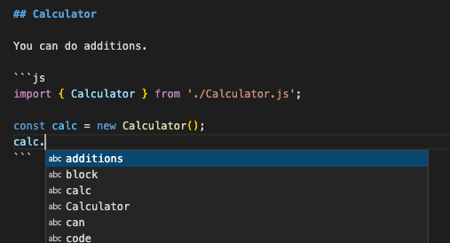

# vscode markdown javascript code block intellisense

Repo for [vscode issue](https://github.com/microsoft/vscode/issues/143009).

When working in markdown you do not get code intellisense while within a javascript code block.

With the following source file `Calculator.js`

```js
export class Calculator {
  /**
   * @param {number} a
   * @param {number} b
   * @returns {number}
   */
  add(a, b) {
    return a + b;
  }
}
```

you do get code intellisense while within a `*.js` file.



but you do NOT get it in `*.md` files while within a code block




## Calculator

You can do additions.

```js
import { Calculator } from './Calculator.js';

const calc = new Calculator();
calc.
```
